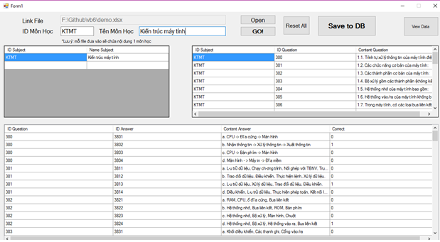
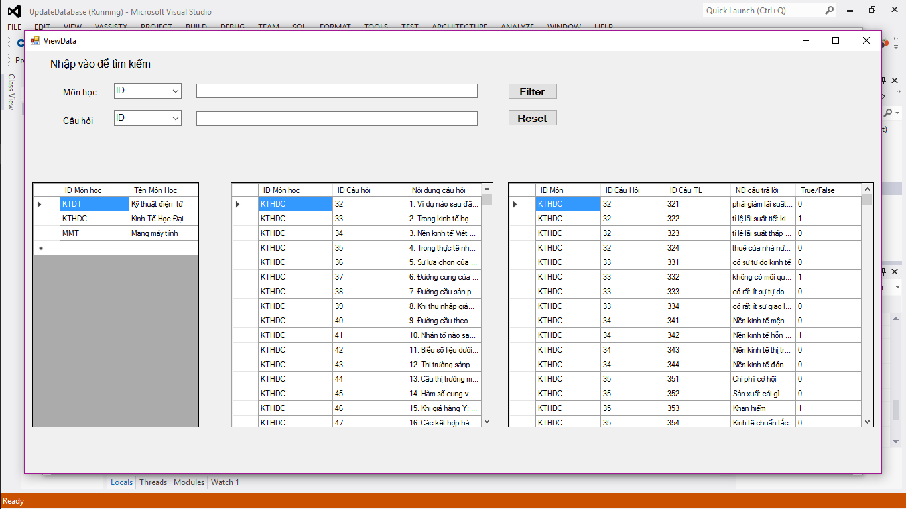
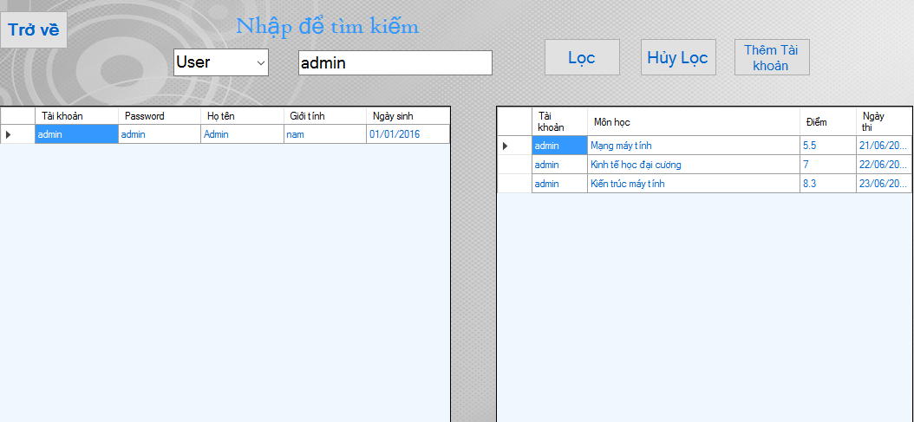
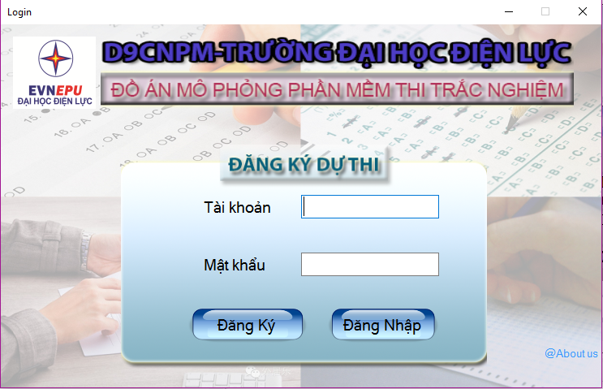
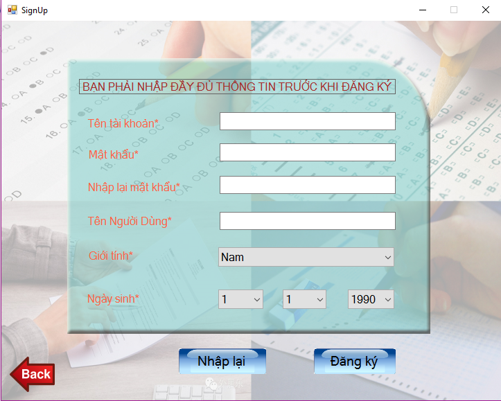
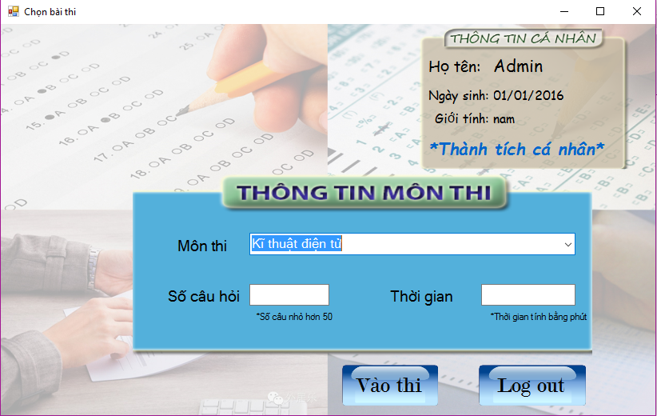
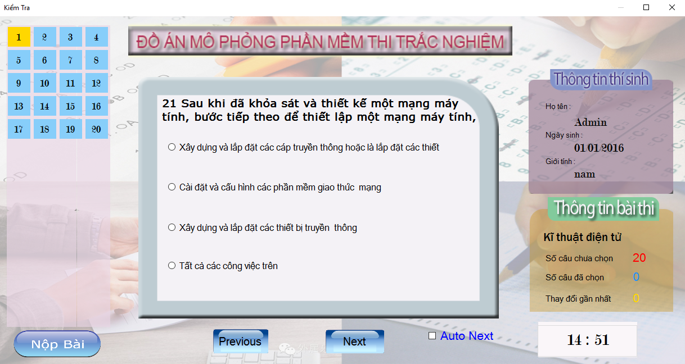

# vb6
An application can help students do exam themself.

Modunle manage (UpdateDatabase):  add, search, update information of users and questions...
 

Modune use (DoAnThiTracNghiem): login, choose the exams and do it.
 

 

